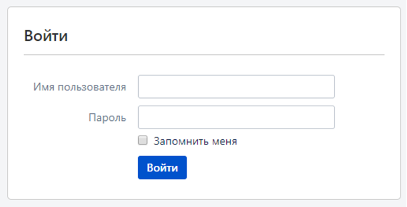

Решение:

Чек-лист	Chrome	Firefox
Требования для тестирования
1	Авторизация валидными данными	Passed	Passed
2	Авторизация невалидными данными	Passed	Passed
3	Обязательность ввода	Passed	Passed
4	Демонстрация ошибки при вводе некорректных данных	Passed	Passed
5	Ввод пробела и невидимых символов	Passed	Passed
6	Многократное нажатие на кнопку "Войти" с невалидным вводом	Passed	Passed
7	Минимальная длина пароля	Passed	Passed
8	Максимальная длина пароля	Passed	Passed
9	Сокрытие/показ вводимого пароля	Passed	Passed
10	Вставка текста в поле	Passed	Passed
11	Ввод некорректных логина и/или пароля	Passed	Passed
12	Попытка авторизации без предварительной регистрации	Passed	Passed
13	Проверка запоминания пароля	Passed	Passed
14	Авторизация по имени пользователя	Passed	Passed
15	Авторизация по номеру телефона	Passed	Passed

тест-кейсы	 	 	 
ID	Summary	Precondition	Steps	Expected Result
R_1	Авторизация валидными данными	Перейти на https://example.ru/login                                        Логин - example@gmail.com, пароль - 123Example	1. Ввести example@gmail.com в поле "Имя пользователя"	1. Логин введен
2. Ввести 123Example в поле "Пароль."	2. Пароль введен
3. Нажать на кнопку "Войти"	3. Успешная авторизация

ID	Summary	Precondition	Steps	Expected Result
R_2	Авторизация невалидными данными	Перейти на https://example.ru/login                                        Логин - example@gmail.com, пароль - 123Example	1. Ввести exampl@gmail.com в поле "Имя пользователя"	1. Логин введен
2. Ввести 124Example в поле "Пароль."	2. Пароль введен
3. Нажать на кнопку "Войти"	3. Отказ в авторизации

ID	Summary	Precondition	Steps	Expected Result
R_3	Обязательность ввода	Перейти на https://example.ru/login                                        Логин - example@gmail.com, пароль - 123Example	1. Оставить поля "Имя пользователя" и "Пароль" пустыми	1. Пустые поля ввода
2. Нажать на кнопку "Войти"	2. Сообщение "Введите логин и пароль"

ID	Summary	Precondition	Steps	Expected Result
R_4	Демонстрация ошибки при вводе некорректных данных	Перейти на https://example.ru/login                                        Логин - example@gmail.com, пароль - 123Example	1. Ввести exampl@gmail.com в поле "Имя пользователя"	1. Логин введен
2. Ввести 124Example в поле "Пароль"	2. Пароль введен
3. Нажать на кнопку "Войти"	3. Сообщение "Логин или пароль введены неверно"

ID	Summary	Precondition	Steps	Expected Result
R_5	Ввод пробела и невидимых символов	Перейти на https://example.ru/login                                        Логин - example@gmail.com, пароль - 123Example	1. Ввести exampl @gmail.com в поле "Имя пользователя"	1. Логин введен
2. Ввести 123 Example в поле "Пароль"	2. Пароль введен
3. Нажать на кнопку "Войти"	3. Сообщение "Логин или пароль введены неверно"

ID	Summary	Precondition	Steps	Expected Result
R_6	Многократное нажатие на кнопку "Войти" с невалидным вводом	Перейти на https://example.ru/login                                        Логин - example@gmail.com, пароль - 123Example	1. Ввести example@gmail.com в поле "Имя пользователя"	1. Логин введен
2. Ввести 124Example в поле "Пароль"	2. Пароль введен
3. Нажать на кнопку "Войти"	3. Отказ в авторизации
4. Повторно нажать на кнопку войти еще 5 раз	4. Уведомление о временной блокировке авторизации

ID	Summary	Precondition	Steps	Expected Result
R_7	Минимальная длина пароля	Перейти на https://example.ru/login                                        Логин - example@gmail.com, пароль - 123Example	1. Ввести example@gmail.com в поле "Имя пользователя"	1. Логин введен
2. Ввести 1Ex в поле "Пароль"	2. Пароль введен
3. Нажать на кнопку "Войти"	3. Сообщение "Пароль должен содержать не менее 6 символов"

ID	Summary	Precondition	Steps	Expected Result
R_8	Максимальная длина пароля	Перейти на https://example.ru/login                                        Логин - example@gmail.com, пароль - 123Example	1. Ввести exampe@gmail.com в поле "Имя пользователя"	1. Логин введен
2. Ввести пароль длиной более 128 символов в поле "Пароль"	2. Пароль введен
3. Нажать на кнопку "Войти"	3. Сообщение "Пароль не должен содержать более 128 символов"

ID	Summary	Precondition	Steps	Expected Result
R_9	Сокрытие/показ вводимого пароля	Перейти на https://example.ru/login                                        Логин - example@gmail.com, пароль - 123Example	1. Ввести example@gmail.com в поле "Имя пользователя"	1. Логин введен
2. Ввести 123Example в поле "Пароль."	2. Пароль введен
3. Нажать на кнопку "Показать пароль"	3. Пароль успешно показан

ID	Summary	Precondition	Steps	Expected Result
R_10	Вставка текста в поле	Перейти на https://example.ru/login                                        Логин - example@gmail.com, пароль - 123Example	1. Вставить логин в поле "Имя пользователя" из буфера обмена	1. Логин введен
2. Вставить пароль в поле "Пароль" из буфера обмена	2. Пароль не был введен

ID	Summary	Precondition	Steps	Expected Result
R_11_1	Ввод некорректных логина и/или пароля	Перейти на https://example.ru/login                                        Логин - example@gmail.com, пароль - 123Example            
На ввод подается пароль без содержания цифр	1. Ввести example@gmail.com в поле "Имя пользователя"	1. Логин введен
2. Заполнить поле "Пароль"	2. Пароль введен
3. Нажать на кнопку "Войти"	3. Сообщение "Логин или пароль введены неверно"

ID	Summary	Precondition	Steps	Expected Result
R_11_2	Ввод некорректных логина и/или пароля	Перейти на https://example.ru/login                                        Логин - example@gmail.com, пароль - 123Example            
На ввод подается пароль без содержания строчных букв	1. Ввести example@gmail.com в поле "Имя пользователя"	1. Логин введен
2. Заполнить поле "Пароль"	2. Пароль введен
3. Нажать на кнопку "Войти"	3. Сообщение "Логин или пароль введены неверно"

ID	Summary	Precondition	Steps	Expected Result
R_11_3	Ввод некорректных логина и/или пароля	Перейти на https://example.ru/login                                        Логин - example@gmail.com, пароль - 123Example            
На ввод подается пароль без содержания заглавных букв	1. Ввести example@gmail.com в поле "Имя пользователя"	1. Логин введен
2. Заполнить поле "Пароль"	2. Пароль введен
3. Нажать на кнопку "Войти"	3. Сообщение "Логин или пароль введены неверно"

ID	Summary	Precondition	Steps	Expected Result
R_11_4	Ввод некорректных логина и/или пароля	Перейти на https://example.ru/login                                        Логин - example@gmail.com, пароль - 123Example            
На ввод подается логин с неполным доменом	1. Ввести example@gmail в поле "Имя пользователя"	1. Логин введен
2. Заполнить поле "Пароль"	2. Пароль введен
3. Нажать на кнопку "Войти"	3. Сообщение "Логин или пароль введены неверно"

ID	Summary	Precondition	Steps	Expected Result
R_11_5	Ввод некорректных логина и/или пароля	Перейти на https://example.ru/login                                        Логин - example@gmail.com, пароль - 123Example            
На ввод подается пароль, содержащий недопустимые символы	1. Ввести example@gmail.com в поле "Имя пользователя"	1. Логин введен
2. Заполнить поле "Пароль"	2. Пароль введен
3. Нажать на кнопку "Войти"	3. Сообщение "Логин или пароль введены неверно"

ID	Summary	Precondition	Steps	Expected Result
R_12	Попытка авторизации без предварительной регистрации	Перейти на https://example.ru/login                                        Логин и пароль отсутствуют	1. Ввести notexample@gmail.com в поле "Имя пользователя"	1. Логин введен
2. Ввести 123Example в поле "Пароль."	2. Пароль введен
3. Нажать на кнопку "Войти"	3. Сообщение "Аккаунта с указанным адресом не существует"

ID	Summary	Precondition	Steps	Expected Result
R_13	Проверка запоминания пароля	Перейти на https://example.ru/login                                        Логин - example@gmail.com, пароль - 123Example	1. Ввести example@gmail.com в поле "Имя пользователя"	1. Логин введен
2. Ввести 123Example в поле "Пароль"	2. Пароль введен
3. Нажать на флажок "Запомнить пароль"	3. Флажок стал активен
4. Нажать на кнопку "Войти"	4. Успешная авторизация
5. Выйти из аккаунта	5. Успешный выход из аккаунта
6. Нажать на кнопку "Авторизироваться"	6. Успешная авторизация

ID	Summary	Precondition	Steps	Expected Result
R_14	Попытка авторизации без предварительной регистрации	Перейти на https://example.ru/login                                        Логин - exampleman, пароль - 123Example	1. Ввести логин в поле "Имя пользователя"	1. Логин введен
2. Ввести 123Example в поле "Пароль."	2. Пароль введен
3. Нажать на кнопку "Войти"	3. Успешная авторизация

ID	Summary	Precondition	Steps	Expected Result
R_15	Попытка авторизации без предварительной регистрации	Перейти на https://example.ru/login                                        Логин - 8999009900, пароль - 123Example	1. Ввести номер телефона в поле "Имя пользователя"	1. Логин введен
2. Ввести 123Example в поле "Пароль."	2. Пароль введен
3. Нажать на кнопку "Войти"	3. Успешная авторизация	
